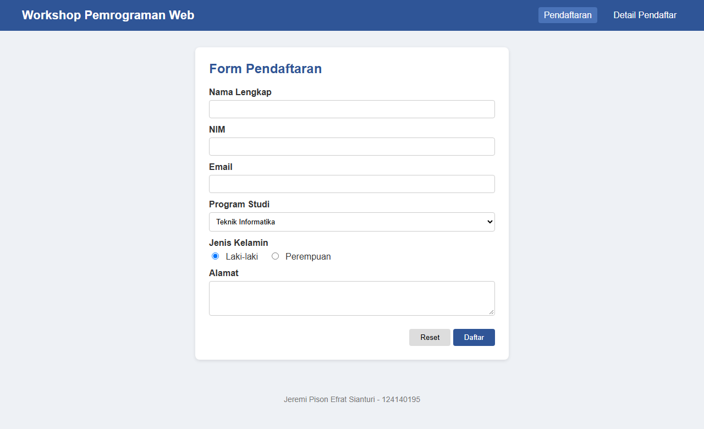
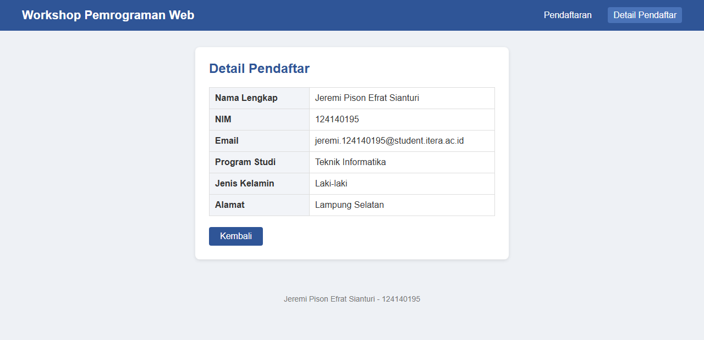

# Tugas 3 PAW

## Data Mahasiswa
- **Nama**  : Jeremi Pison Efrat Sianturi
- **NIM**   : 124140195
- **Kelas** : RB

Hosting GitHub Pages: https://jeremi16.github.io/PAW2026_124140195/task_3/

## Isi Tugas
1. `index.html` berisi form pendaftaran dengan method GET yang mengarah ke `detail.html`.
2. `detail.html` berisi detail pendaftar dalam bentuk tabel (data dummy).
3. `style.css` berisi desain layout, box, tabel, dan form.

## Desain Query String
Setelah tombol Daftar ditekan, data dikirim lewat URL seperti ini:

```
detail.html?nama=Jeremi+Pison+Efrat+Sianturi&nim=124140195&email=jeremi.124140195%40student.itera.ac.id&prodi=Teknik+Informatika&jk=L&alamat=Lampung+Selatan
```

## Selector CSS yang Digunakan
- Element selector: `body`, `table`, `footer`
- Class selector: `.box`, `.tombol`, `.kembali`
- ID selector: `#form-daftar`
- Attribute selector: `input[type="text"]`, `button[type="submit"]`
- Pseudo-class: `:hover`, `:focus`

## Screenshot

### Halaman Pendaftaran


### Halaman Detail Pendaftar

